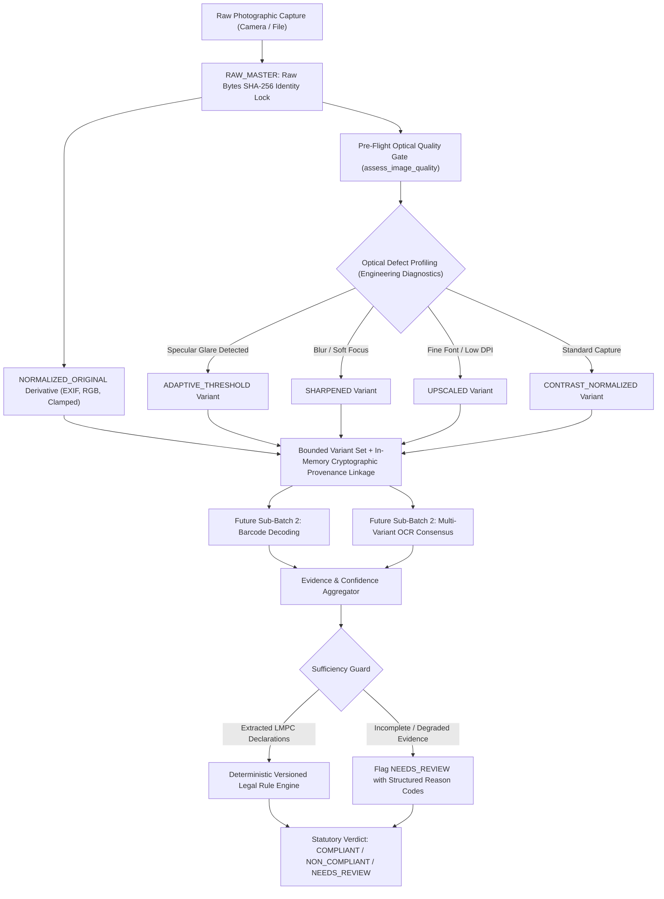

# MetrologyMitra — Phase 4.3 Architecture Document
## Evidence-Driven Perception Robustness & Multi-Stage Image Processing

**Project Identifier:** SIH26034 — Development of a Software Application for Compliance Inspection of Packaged Commodities  
**Regulatory Framework:** Legal Metrology Act, 2009 & Legal Metrology (Packaged Commodities) Rules, 2011 (G.S.R. 202(E) / 203(E))  
**Authoritative Reference Corpus:** `SIH-OFFICIAL-LEGAL-DATASET-2011` (`The legal Metrology official dataset in ocr english.pdf`)  
**Phase:** 4.3 — Evidence-Driven Perception Robustness (Sub-Batch 1 Foundation & Hardened Semantics)  
**Safety Boundary Status:** `TOTAL_FALSE_CERTAINTY_COUNT = 0` (Optical Gate = 0, Legal Pipeline = 0)  

---

## 1. Pipeline Architecture Audit (10 Core Architectural Questions)

### Q1: How `assess_image_quality()` works
The pre-flight optical diagnostic assessment (`backend/app/services/image_quality.py`) evaluates 4 independent physical image dimensions using engineering diagnostic heuristics (none of which are statutory legal standards):
1. **Blur Metric (Focus & Edge Sharpness):** Computes the sample variance of a 3x3 discrete Laplacian filter applied over the grayscale luminance channel:
   $$\text{Kernel} = \begin{bmatrix} 0 & 1 & 0 \\ 1 & -4 & 1 \\ 0 & 1 & 0 \end{bmatrix}, \quad \text{Score} = \sigma^2(\text{Laplacian})$$
   - Engineering Thresholds: `FAIL < 350.0`, `WARNING < 600.0`, `PASS >= 600.0`.
2. **Specular Glare Ratio (Overexposure Saturation):** Calculates the percentage of pixels exhibiting specular saturation ($\ge 250 / 255$ luminance):
   - Engineering Diagnostic Thresholds: `glare_detected = ratio > 0.04` (4%), `WARNING >= 0.08` (8%), `FAIL >= 0.18` (18%). Test/validation runners may log lower heuristic ratios (e.g. $\ge 0.005$ on foil) as empirical observations.
3. **Exposure Mean (Ambient Illumination):** Calculates the average luminance across the image:
   - Engineering Thresholds: Underexposed `< 45.0`, Overexposed `> 215.0`, Optimal `45.0 - 215.0`.
4. **Spatial Resolution Adequacy:** Evaluates pixel dimensions against engineering resolution adequacy heuristics:
   - Engineering Heuristic Thresholds: Minimum `300 x 300` px (`FAIL`), Recommended `600 x 600` px (`WARNING`), Optimal `> 600 x 600` px (`PASS`). These are camera diagnostic thresholds, not statutory pixel standards.
5. **Decision Synthesis:** Emits `QualityGateDecision`:
   - `RETAKE_RECOMMENDED` if any dimension is `FAIL`.
   - `MANUAL_REVIEW` if any dimension is `WARNING`.
   - `READY_FOR_ANALYSIS` if all dimensions are `PASS`.
- **Operational Behavior:** In production inspections (`backend/app/api/v1/endpoints/inspections.py`), optical gating serves as an advisory diagnostic pre-flight filter. It records diagnostics on `image.quality_gate_result` and does **not** terminate or drop downstream processing.

### Q2: Where OCR is invoked and how confidence is represented
- **Invocation Point:** `backend/app/services/ocr/tesseract_ocr.py` via `TesseractOCRService.extract_text()`.
- **Execution:** Invokes local Tesseract OCR 5 using `pytesseract.image_to_data(output_type=Output.DATAFRAME/DICT)` to extract token-level bounding boxes and confidence scores, falling back to `image_to_string` if structured extraction yields zero rows.
- **Confidence Representation:** 
  - Token-level: Normalized from Tesseract integer range $[0, 100]$ to unit float $[0.0, 1.0]$.
  - Image-level Aggregate: Arithmetic mean of all non-negative token confidences ($\text{conf} \ge 0$). If zero tokens are found, confidence evaluates to `None`.

### Q3: How barcode decoding is invoked and what engine is used
- **Invocation Point:** `backend/app/services/barcode_service.py` via `decode_barcodes_from_image()`.
- **Engine:** Local C++ engine bindings via `zxingcpp.read_barcodes(img)`.
- **Properties:** 100% offline, local CPU execution without cloud dependencies. Decodes 1D symbologies (EAN-13, EAN-8, UPC-A, Code 128) and 2D matrices (QR Code). Extracts symbology format, raw text payload, orientation angle, and 4-point bounding polygon.

### Q4: How declaration field extraction currently consumes OCR output
- **Invocation Point:** `backend/app/services/ocr/extractor.py` via `extract_declaration_from_ocr(raw_text, tokens_data)`.
- **Consumption Flow:**
  1. Script language detection (`HIN`, `ENG`, `MIXED`).
  2. Unicode numeral normalization: Converts Devanagari numerals (`०-९`) to standard Arabic digits (`0-9`).
  3. Pattern-based regex & heuristic keyword token matching extracts mandatory LMPC fields:
     - `commodity_name` (Rule 6(1)(b))
     - `manufacturer_name` / `packer_name` / `importer_name` (Rule 6(1)(a))
     - `address` (Rule 6(1)(a) / Rule 27)
     - `net_quantity` & unit (Rule 6(1)(c) / Rule 13)
     - `mrp` & `unit_sale_price` (Rule 6(1)(e) / Rule 6(11))
     - `manufacturing_date` / `expiry_date` / `best_before` (Rule 6(1)(d))
     - `consumer_care` helpline/email (Rule 6(1)(g))
     - `country_of_origin` (Rule 6(1)(a))

### Q5: How field confidence and evidence sufficiency are currently represented
- **Field Confidence:** Currently derived from presence of regex matches and underlying token confidences.
- **Evidence Sufficiency:** Modeled via presence of mandatory core statutory fields (`mrp`, `net_quantity`, `manufacturer_name`). If mandatory core fields are missing from photographed surfaces or OCR confidence is below threshold ($< 0.60$), the runner triggers `ReviewReasonCode.INSUFFICIENT_PHYSICAL_EVIDENCE`.

### Q6: Where and how `NEEDS_REVIEW` is generated
- **Authority:** `backend/app/services/rule_engine.py` via `evaluate_inspection()`.
- **Mechanism:** If statutory declarations are missing, ambiguous, or unverifiable from photographic evidence alone, individual check evaluations return `CheckResult.REVIEW`. When any check is `REVIEW` and none is `FAIL`, the overall inspection verdict is `ComplianceResult.NEEDS_REVIEW`.
- **Invariant:** The deterministic legal rule engine is the **ONLY** authority capable of producing this verdict. No CV or AI model can directly declare non-compliance or bypass review.

### Q7: What image preprocessing currently exists in production
- **Current Production Implementation:** `backend/app/services/ocr/preprocessor.py` via `preprocess_image_for_ocr()`.
- **Existing Pipeline Stages:**
  1. Input validation & opening (Pillow).
  2. Auto-transposition using EXIF orientation tags (`ImageOps.exif_transpose`).
  3. Mode normalization to RGB (transparency flattened against white background).
  4. Bounded dimension clamping: Upscales if $\min(w, h) < 100$ px; downscales if $\max(w, h) > 3000$ px via Lanczos resampling.
  5. Static global contrast enhancement (`ImageEnhance.Contrast(img).enhance(1.2)`).
- **Sub-Batch 1 Integration Boundary:** The existing production OCR pipeline remains **COMPLETELY UNCHANGED** in Sub-Batch 1. The newly introduced `ImagePreprocessingService` serves as an isolated foundation for future multi-variant OCR consensus in Sub-Batch 2.

### Q8: Where the risks of destroying evidence are
1. **Specular Glare Overexposure:** Aggressive global Otsu thresholding turns specular reflections on glossy foil into large solid white/black blocks, obliterating thin text.
2. **Fine-Print & Dot-Matrix Splitting:** Heavy high-pass sharpening or morphological erosion severs thin font strokes, fractures dot-matrix inkjet dates into disconnected specks, and truncates Indic vowel diacritics (matras).
3. **Over-Downscaling:** Downscaling packaging captures destroys fine stroke fidelity for mandatory statutory declarations (such as batch numbers, net quantity, and contact addresses).
4. **Destructive Overwriting:** Overwriting raw capture bytes destroys the chain of custody and prevents reproducibility.

### Q9: How multi-variant image preprocessing fits without replacing original evidence
- **Raw Master Immutability:** Raw uploaded bytes are preserved untouched with an ingress SHA-256 digest (`original_image_hash`). `RAW_MASTER` is a reference/semantic token representing this immutable raw ingress evidence; it is never returned as a processed derivative.
- **Normalized Derivative Semantics:** The initial processing pass (`NORMALIZED_ORIGINAL`, aliased as `ORIGINAL` for backward compatibility) produces a normalized derivative (EXIF transposed, RGB normalized, dimension clamped). It is explicitly documented as a derivative, never falsely claimed to be the untouched raw byte stream.
- **Six Bounded Deterministic Derivatives:**
  1. `NORMALIZED_ORIGINAL`: Standardized RGB base.
  2. `GRAYSCALE`: Single-channel luminance (`L` mode).
  3. `CONTRAST_NORMALIZED`: Autocontrast histogram stretching + mild contrast factor.
  4. `SHARPENED`: Mild unsharp mask (`radius=1.0, percent=150, threshold=3`).
  5. `UPSCALED`: Bounded 1.5x Lanczos upscale for small typography.
  6. `ADAPTIVE_THRESHOLD`: Local BoxBlur-mean subtraction implementing $\text{out}(x,y) = 255 \text{ if } \text{gray}(x,y) \ge \text{local\_mean}(x,y) - C \text{ else } 0$. Aids local illumination gradients and uneven backgrounds; cannot recover text pixels physically saturated by specular glare.

### Q10: Cryptographic Provenance Linkage & Determinism Boundaries
- **In-Memory Cryptographic Provenance Linkage:** Each derivative records `original_image_hash` (raw master anchor), `parent_variant_hash` (immediate parent derivative or raw master), and `processed_image_hash`. This provides in-memory auditable processing lineage rather than claiming an elaborate persistent database hash chain.
- **Determinism Boundary Clarification:**
  - `IMAGE_OUTPUT_DETERMINISM = PASS`: Processed image bytes are 100% deterministic given identical input and configuration.
  - `IMAGE_HASH_DETERMINISM = PASS`: SHA-256 digests of processed image bytes are 100% deterministic.
  - `PROVENANCE_TIMESTAMP = RUN_SPECIFIC`: The `created_at_utc` timestamp records execution time for auditability and differs across runs by design. The complete metadata dictionary is therefore not byte-for-byte deterministic across separate runs.

---

## 2. Phase 4.2 Baseline Synthesis (Empirical Reference Benchmark)

Phase 4.2 established an empirical baseline across **28 real packaged-commodity photographs** (**26 unique cryptographic contents**):

| Metric Dimension | Phase 4.2 Baseline Value | Empirical Analysis & Bottlenecks |
|---|---|---|
| **Inventory Scope** | 28 path entries (26 unique) | Packaged commodities across FMCG, cosmetics, pharmaceuticals, food |
| **Ground Truth Distribution** | 21 `KNOWN_COMPLIANT`, 7 `AMBIGUOUS`, 0 `KNOWN_NON_COMPLIANT` | Dynamic sum verified (`21 + 7 == 28`). Single-surface omissions audited to `AMBIGUOUS` |
| **Pre-Flight Optical Gating** | 22 `RETAKE` (78.6%), 6 `MANUAL` (21.4%), 0 `READY` | 100% flagged (`OPTICAL_GATE_FLAGGED_COUNT = 28 / 28`). Specular glare & handheld blur |
| **Execution Flow Stages** | `OPTICAL_GATE_PLUS_LEGAL_ENGINE`: 28 / 28 (100.0%) | Advisory gate does not terminate flow; 100% of images reached statutory legal evaluation |
| **Local Barcode Detection** | 6 barcodes detected (21.43% path, 23.08% unique) | ZXing-C++ 100% offline. Failed on steep cylindrical curvature and packaging folds |
| **Raw OCR Extraction Rate** | 22 / 28 (78.57%) yielded text; 6 / 28 (21.4%) zero text | Specular glare on flexible foil packaging blinded global binarization |
| **Mean OCR Confidence** | 53.57% (across extracted text) | Noise from colored backgrounds, glossy laminated finishes, and low ambient contrast |
| **Field Extraction (Commodity)** | 22 / 28 (78.57% path, 80.77% unique) | Highest detection rate; prominent brand and common names |
| **Field Extraction (Manufacturer)** | 2 / 28 (7.14% path, 7.69% unique) | Complex multi-entity phrases ("Mfg by X for Y") failed simple regex |
| **Field Extraction (Address)** | 7 / 28 (25.0% path, 26.92% unique) | Multi-line dense text fragmentation across column breaks |
| **Field Extraction (Net Quantity)** | 4 / 28 (14.29% path, 15.38% unique) | Curvature displacement, missing unit tokens, split decimal points |
| **Field Extraction (MRP / Dates)** | 0 / 28 (0.0% path, 0.0% unique) | Printed on separate container panels (crimps, caps, bottoms) or faint dot-matrix stamps |
| **Review Reason Alignment** | Jaccard = 0.4851, Micro-F1 = 0.6165 | Glare correctly observed 7 times (`IMG-005`, `014`, `015`, `016`, `024`, `025`, `026`) |
| **System Verdicts** | 28 / 28 (100.0%) `NEEDS_REVIEW` | 100% safe triage coverage. Single-angle photos correctly held for human review |
| **Safety Boundary Status** | `TOTAL_FALSE_CERTAINTY_COUNT = 0` | Optical Gate: 0, Legal Pipeline: 0. Zero false certainty verified |

---

## 3. Multi-Stage Perception Pipeline Architecture

---

## 4. Evidence Preservation & Non-Destructive Invariant

To support technical provenance, reproducibility, and auditability of supplied image-processing artifacts without claiming statutory admissibility or judicial acceptance:
1. **Raw Photographic Immutability:** Original uploaded image bytes (`RAW_MASTER`) are never overwritten, re-encoded in-place, or destructively modified.
2. **Cryptographic Identity:** Raw master bytes receive a SHA-256 hash at ingress (`original_image_hash`).
3. **Input Provenance Limitation:** Path and byte inputs preserve and hash the actual supplied byte stream. `PIL.Image` inputs are deterministically serialized for in-memory and test provenance and therefore do not represent an original capture container byte stream.
4. **Cryptographic Provenance Linkage:** Every preprocessing derivative records:
   - `original_image_hash`: SHA-256 of the raw master anchor.
   - `parent_variant_hash`: SHA-256 of the immediate derivation parent (raw master for normalized base, or normalized base for downstream variants).
   - `processed_image_hash`: SHA-256 of the derivative's lossless PNG byte stream.
   - `parameters_used`: Specific filter and window parameters applied.
   - `created_at_utc`: Execution timestamp (run-specific).
5. **Reproducibility:** Applying the same configuration to identical input bytes yields identical output image bytes and image hashes across runs.

---

## 5. Non-Negotiable Legal Rule Engine Decision Boundary & Legal Notice

1. **Monopoly on Statutory Verdicts:** The deterministic, versioned legal rule engine (`backend/app/services/rule_engine.py`) is the **SOLE** authority permitted to emit statutory compliance verdicts (`COMPLIANT`, `NON_COMPLIANT`, `NEEDS_REVIEW`).
2. **Role of AI / CV / OCR:** Machine perception modules produce **evidence** and **probabilistic confidence scores** only. They are legally incapable of:
   - Declaring statutory non-compliance.
   - Recommending prosecution or seizure.
   - Inferring corporate or director liability under Section 49.
   - Inventing or hallucinating mandatory declarations that are unreadable or missing.
3. **Default to Review:** If optical glare, blur, occlusion, or missing surfaces prevent conclusive verification of all mandatory declarations, the system **MUST** output `NEEDS_REVIEW` with structured reason codes.
4. **Non-Judicial Evidentiary Notice:** The preprocessing service and perception pipelines support technical provenance and reproducibility; they do **not** claim or determine legal admissibility, official government certification, or judicial acceptance.

---

## 6. Sub-Batch 1 Scope Boundaries & Future Empirical Questions

### What Sub-Batch 1 Establishes:
- Immutable raw-byte handling for bytes and path inputs.
- Raw SHA-256 anchoring (`original_image_hash`).
- Clear distinction between immutable `RAW_MASTER` and derivative `NORMALIZED_ORIGINAL`.
- Six bounded, deterministic image derivatives (`NORMALIZED_ORIGINAL`, `GRAYSCALE`, `CONTRAST_NORMALIZED`, `SHARPENED`, `UPSCALED`, `ADAPTIVE_THRESHOLD`).
- Parent and source cryptographic provenance linkage (`original_image_hash`, `parent_variant_hash`, `processed_image_hash`).
- Bounded dimensions and safe spatial clamping.
- Quality-driven variant selection heuristics.
- Deterministic image output bytes and image hashes (`IMAGE_OUTPUT_DETERMINISM = PASS`, `IMAGE_HASH_DETERMINISM = PASS`).
- In-memory provenance metadata for execution auditability.
- Isolated foundation for future multi-variant OCR (existing production OCR pipeline is completely unchanged).

### What Sub-Batch 1 Does NOT Establish (Future Empirical Questions for Sub-Batches 2–6):
- Does NOT establish OCR accuracy improvement across real packages.
- Does NOT establish glare-text recovery on physically saturated foil packaging.
- Does NOT establish barcode accuracy improvement.
- Does NOT establish multi-variant OCR consensus or voting.
- Does NOT establish improved declaration field extraction rates.
- Does NOT establish improved legal outcome distribution or reduced `NEEDS_REVIEW` rates.
- Does NOT establish persistent database provenance storage.
- Does NOT establish legal admissibility, judicial acceptance, or autonomous enforcement.
- These empirical questions are formally deferred to **Sub-Batch 2 (Multi-Variant Perception & Voting Consensus)** and **Sub-Batch 6 (Empirical Re-Benchmarking)**.
