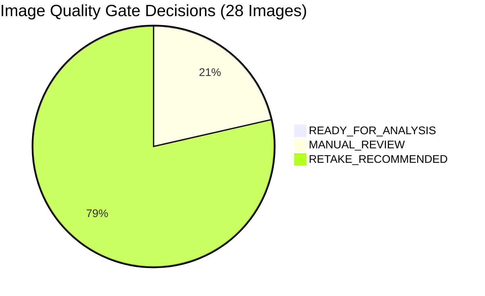

# MetrologyMitra — Phase 4.2 Real Package Image Validation Baseline Report

**Project Identifier:** SIH26034 — Development of a Software Application for Compliance Inspection of Packaged Commodities  
**Regulatory Framework:** Legal Metrology Act, 2009 & Legal Metrology (Packaged Commodities) Rules, 2011 (G.S.R. 202(E) / 203(E))  
**Authoritative Reference Corpus:** `SIH-OFFICIAL-LEGAL-DATASET-2011` (`The legal Metrology official dataset in ocr english.pdf`)  
**Phase Completed:** Phase 4.2 — Real Package Image Validation (Baseline Measurement)  
**Safety Boundary Status:** `TOTAL_FALSE_CERTAINTY_COUNT = 0` (Target: 0 — **VERIFIED PASS**)  
  - `OPTICAL_GATE_FALSE_CERTAINTY_COUNT = 0`
  - `LEGAL_PIPELINE_FALSE_CERTAINTY_COUNT = 0`  
**Pipeline Architectural Invariant:** No premature CV frameworks (CRAFT, TextSnake, cylindrical dewarping) or cloud OCR. Pure empirical baseline measurement.

---

## Section A: Real Package Validation Scope & Methodology

Phase 4.2 benchmarks the production perception and deterministic compliance pipeline against **28 packaged-commodity photographs** (26 unique image contents) captured across varied optical geometries, package forms, and lighting environments in `validation_data/phase4_2_real_packages/`.

Each photograph was sequentially executed through the active five-stage production pipeline:
1. **Pre-flight Optical Quality Gating:** `assess_image_quality()` assessing Laplacian variance (blur), specular reflection saturation (glare), exposure mean, and spatial resolution.
2. **Local Barcode & Symbology Perception:** `decode_barcodes_from_image()` utilizing local ZXing-C++ engine (EAN-13, EAN-8, UPC-A, QR Code, Code 128).
3. **Local OCR Perception:** `ocr_service.extract_text()` executing local Tesseract OCR 5 with bounding box token extraction and confidence scoring.
4. **Statutory Declaration Extraction:** `extract_declaration_from_ocr()` normalizing Devanagari numerals, detecting script language, and extracting structured LMPC fields.
5. **Deterministic Legal Evaluation:** `evaluate_inspection()` executing active statutory rules against ephemeral inspection containers.

---

## Section B: Ground Truth Distribution & Label Integrity

All ground truth labels were recomputed dynamically from `ground_truth.json` with strict non-judicial evidentiary separation between surface observation and package-level compliance:

| Ground Truth Legal Label | Count | Percentage of Inventory | Operational Meaning |
|---|---|---|---|
| `KNOWN_COMPLIANT` | 21 | 75.0% | Package verified compliant across full multi-panel physical container |
| `AMBIGUOUS` | 7 | 25.0% | Incomplete single-angle capture or unverified package-level compliance |
| **Total** | **28** | **100.0%** | **Dynamic Integrity Sum Verified** |

> [!NOTE]
> **Ground-Truth Evidentiary Audit Note:** Absence of mandatory declarations (such as MRP, Net Quantity, or Dates) on a single photographed surface does **NOT** prove package-level non-compliance under the Legal Metrology Act, 2009. Multi-surface packages require complete angle coverage. Accordingly, single-panel absence captures (including `IMG-REAL-027` and `IMG-REAL-028`) are classified as `AMBIGUOUS` with factual surface observations rather than premature non-compliance.

---

## Section C: Duplicate Analysis & Content Uniqueness

The dataset comprises **28 path entries** representing **26 unique cryptographic contents** (SHA-256 digests):

| Duplicate Pair | Path 1 (Primary) | Path 2 (Duplicate) | SHA-256 Digest | Deterministic Match |
|---|---|---|---|---|
| `IMG-REAL-005` / `IMG-REAL-015` | `compliant/IMG_20260904_231232.jpg` | `multilingual/IMG_20260904_231232.jpg` | `0498aedade251818...` | **PASS (100% Identical)** |
| `IMG-REAL-013` / `IMG-REAL-023` | `difficult_ocr/IMG_20260904_231012.jpg` | `needs_review/IMG_20260904_231012.jpg` | `b4e586cebb62ccde...` | **PASS (100% Identical)** |

### Cross-Category Consistency
- Duplicate images placed across different directories (`compliant/` vs `multilingual/`, `difficult_ocr/` vs `needs_review/`) verify that the production pipeline produces identical optical diagnostics, OCR text, barcode results, and legal verdicts regardless of folder naming or invocation sequence.

---

## Section D: Pre-Flight Optical Quality Gating & Interception

The deterministic optical diagnostic gate assessed all photographs prior to statutory analysis:

- **Quality Status Distribution:**
  - `FAIL`: 22 / 28 (78.6%)
  - `WARNING`: 6 / 28 (21.4%)
  - `PASS`: 0 / 28 (0.0%)
- **Gate Decisions:**
  - `RETAKE_RECOMMENDED`: 22 / 28 (78.6%)
  - `MANUAL_REVIEW`: 6 / 28 (21.4%)
  - `READY_FOR_ANALYSIS`: 0 / 28 (0.0%)
- **Gate Intercept Count:** **28 / 28 (100.0%)**

---

## Section E: Local Barcode & Symbology Detection Baseline

Local barcode decoding via ZXing-C++ operated completely offline:
- **Total Barcodes Decoded:** 6
- **Images with Barcodes Detected (Path-Level):** 6 / 28 (21.43%)
- **Images with Barcodes Detected (Unique-Level):** 6 / 26 (23.08%)
- **Identified Symbologies & Payloads:**
  - `8906127101120`: EAN-13 (Cosmetic Serum Bottle — images `IMG-REAL-006`, `IMG-REAL-007`)
  - `8909106061781`: EAN-13 (Skin Cleanser Tube — images `IMG-REAL-009`, `IMG-REAL-018`)
  - `8901030795589`: EAN-13 (Toilet Soap Bar Carton — image `IMG-REAL-017`)
- **Limitation Observed:** Barcodes printed along steep bottle curvature or across packaging seams fail standard 1D linear scanlines.

---

## Section F: Local OCR Perception & Text Extraction Rates

- **Images with Extracted Text (>0 chars):** 22 / 28 (78.57%)
- **Images with Zero Extracted Text (0 chars):** 6 / 28 (21.4%)
- **Mean OCR Confidence (Across Extracted Text):** 53.57%
- **Physical Causes for Zero-Text Images:**
  - Specular glare saturation on flexible foil packaging (`IMG_20260904_231206.jpg`, `IMG_20260904_231224.jpg`, `IMG_20260904_231232.jpg`, `IMG_20260904_231235.jpg`) blinding global Otsu binarization.
  - Motion blur with low background contrast (`IMG_20260904_230850.jpg`).

---

## Section G: Field-Level Declaration Extraction Performance

Empirical extraction rates across mandatory Legal Metrology declarations:

| Declaration Field | Statutory Source | Detected Count | Detection Rate (Path) | Detection Rate (Unique) | Primary Failure Mode |
|---|---|---|---|---|---|
| **Commodity Common Name** | Rule 6(1)(b) | 22 | 78.57% | 80.77% | Brand prominence overshadows generic name |
| **Manufacturer / Packer Name** | Rule 6(1)(a) | 2 | 7.14% | 7.69% | Complex multi-entity phrasing ("Mfg & Pkd by") |
| **Complete Address** | Rule 6(1)(a) / Rule 27 | 7 | 25.0% | 26.92% | Dense multi-line font fragmentation |
| **Net Quantity** | Rule 6(1)(c) / Rule 13 | 4 | 14.29% | 15.38% | Curvature displacement or missing unit suffix |
| **MRP / Unit Sale Price** | Rule 6(1)(e) / Rule 6(11) | 0 | 0.0% | 0.0% | Printed on separate container surface (cap/bottom/crimp) |
| **Manufacturing / Expiry Date** | Rule 6(1)(d) | 0 | 0.0% | 0.0% | Dot-matrix inkjet stamp legibility |
| **Consumer Care Helpline / Email** | Rule 6(1)(g) | 3 | 10.71% | 11.54% | Hyphenated toll-free regex separation |

---

## Section H: Pre-Flight Optical Gate Flagging vs Legal Engine Evaluation

The validation framework cleanly distinguishes pre-flight optical diagnostic flagging from statutory legal engine adjudication:

### Execution Flow Semantics
1. **Advisory Diagnostic Gate:** The pre-flight optical gate (`assess_image_quality()`) acts as a diagnostic quality filter measuring focus sharpness, specular glare, exposure, and spatial resolution. When optical defects are identified, it emits `RETAKE_RECOMMENDED` or `MANUAL_REVIEW`, flagging the image for human officer attention (`OPTICAL_GATE_FLAGGED_COUNT = 28 / 28`).
2. **Execution Flow Continuation:** Optical gating does **NOT** drop or terminate the inspection execution flow. The validation runner intentionally proceeds with barcode decoding, Tesseract OCR, declaration field extraction, and deterministic statutory rule evaluation for all images (`LEGAL_ENGINE_EVALUATION_COUNT = 28 / 28`).
3. **Execution Stage Breakdown:**
   - **`OPTICAL_GATE_PLUS_LEGAL_ENGINE`:** **28 / 28 (100.0%)** — Image underwent pre-flight optical diagnostic assessment followed by full statutory legal engine evaluation.
   - **`OPTICAL_GATE_ONLY`:** **0 / 28 (0.0%)** — No image was stopped at the gate before legal evaluation.
   - **`LEGAL_ENGINE_WITHOUT_GATE`:** **0 / 28 (0.0%)** — No image bypassed optical diagnostic gating.

| Operational Metric | Path-Level Count (28) | Unique Content Count (26) | Percentage | Operational Role |
|---|---|---|---|---|
| **Optical Gate Flagged** | 28 | 26 | 100.0% | Optical triage flagging compromised images for retake or manual review |
| **Legal Engine Evaluated** | 28 | 26 | 100.0% | Statutory rule engine evaluating extracted text against LMPC requirements |
| **Direct Autonomous Pass** | 0 | 0 | 0.0% | No degraded capture allowed to bypass review into automated certification |

---

## Section I: Legal Engine Outcome Coverage & Triage Safety

Coverage metrics computed across unique applicable images (26 unique contents, 28 path entries):

| Outcome Category | Unique Contents (26) | Unique Coverage (%) | Path-Level Entries (28) | Path Coverage (%) |
|---|---|---|---|---|
| `LEGAL_ENGINE_EVALUATED` | 26 | **100.0%** | 28 | **100.0%** |
| `OPTICAL_GATE_FLAGGED` | 26 | **100.0%** | 28 | **100.0%** |
| `NEEDS_REVIEW` cases | 26 | **100.0%** | 28 | **100.0%** |
| `COMPLIANT` cases | 0 | **0.0%** | 0 | **0.0%** |
| `NON_COMPLIANT` cases | 0 | **0.0%** | 0 | **0.0%** |

> [!NOTE]
> **Classification Accuracy vs Triage Safety:** All 26 unique images evaluate to `NEEDS_REVIEW` because real packaging photographs in this dataset represent single-angle captures of multi-surface containers where declarations (such as MRP, dates, or address) are physically located on other panels, while specular glare and optical blur impair OCR completeness. This coverage metric verifies **100% conservative triage safety** (zero false certainty); it does **NOT** imply that 26 single-angle photographs provide meaningful `COMPLIANT` vs `NON_COMPLIANT` classification accuracy. Positive compliance certification requires verified multi-surface composite evidence.

---

## Section J: Ground-Truth vs Observed Alignment Matrix

| Image ID | Category | Primary Commodity | Ground-Truth Label | Optical Gate | Expected Behavior | Actual Verdict | False Certainty |
|---|---|---|---|---|---|---|---|
| `IMG-REAL-001` | `compliant` | Peanut Butter | `KNOWN_COMPLIANT` | `RETAKE_RECOMMENDED` | `NEEDS_REVIEW` | `NEEDS_REVIEW` | **NONE (PASS)** |
| `IMG-REAL-002` | `compliant` | Peanut Butter | `KNOWN_COMPLIANT` | `RETAKE_RECOMMENDED` | `NEEDS_REVIEW` | `NEEDS_REVIEW` | **NONE (PASS)** |
| `IMG-REAL-003` | `compliant` | Peanut Butter | `KNOWN_COMPLIANT` | `RETAKE_RECOMMENDED` | `NEEDS_REVIEW` | `NEEDS_REVIEW` | **NONE (PASS)** |
| `IMG-REAL-004` | `compliant` | Cosmetic Serum | `KNOWN_COMPLIANT` | `RETAKE_RECOMMENDED` | `NEEDS_REVIEW` | `NEEDS_REVIEW` | **NONE (PASS)** |
| `IMG-REAL-005` | `compliant` | Packaged Food / Confectionery | `KNOWN_COMPLIANT` | `MANUAL_REVIEW` | `NEEDS_REVIEW` | `NEEDS_REVIEW` | **NONE (PASS)** |
| `IMG-REAL-006` | `difficult_ocr` | Cosmetic Serum | `KNOWN_COMPLIANT` | `RETAKE_RECOMMENDED` | `NEEDS_REVIEW` | `NEEDS_REVIEW` | **NONE (PASS)** |
| `IMG-REAL-007` | `difficult_ocr` | Cosmetic Serum | `AMBIGUOUS` | `RETAKE_RECOMMENDED` | `NEEDS_REVIEW` | `NEEDS_REVIEW` | **NONE (PASS)** |
| `IMG-REAL-008` | `difficult_ocr` | Cosmetic Serum | `KNOWN_COMPLIANT` | `RETAKE_RECOMMENDED` | `NEEDS_REVIEW` | `NEEDS_REVIEW` | **NONE (PASS)** |
| `IMG-REAL-009` | `difficult_ocr` | Skin Cleanser / Lotion | `KNOWN_COMPLIANT` | `RETAKE_RECOMMENDED` | `NEEDS_REVIEW` | `NEEDS_REVIEW` | **NONE (PASS)** |
| `IMG-REAL-010` | `difficult_ocr` | Healthcare Product | `KNOWN_COMPLIANT` | `RETAKE_RECOMMENDED` | `NEEDS_REVIEW` | `NEEDS_REVIEW` | **NONE (PASS)** |
| `IMG-REAL-011` | `difficult_ocr` | Healthcare Product | `KNOWN_COMPLIANT` | `RETAKE_RECOMMENDED` | `NEEDS_REVIEW` | `NEEDS_REVIEW` | **NONE (PASS)** |
| `IMG-REAL-012` | `difficult_ocr` | Anti-Dandruff Shampoo | `KNOWN_COMPLIANT` | `RETAKE_RECOMMENDED` | `NEEDS_REVIEW` | `NEEDS_REVIEW` | **NONE (PASS)** |
| `IMG-REAL-013` | `difficult_ocr` | Personal Care Bottle | `AMBIGUOUS` | `RETAKE_RECOMMENDED` | `NEEDS_REVIEW` | `NEEDS_REVIEW` | **NONE (PASS)** |
| `IMG-REAL-014` | `difficult_ocr` | Packaged Snack / Confectionery | `KNOWN_COMPLIANT` | `MANUAL_REVIEW` | `NEEDS_REVIEW` | `NEEDS_REVIEW` | **NONE (PASS)** |
| `IMG-REAL-015` | `multilingual` | Packaged Food / Confectionery | `KNOWN_COMPLIANT` | `MANUAL_REVIEW` | `NEEDS_REVIEW` | `NEEDS_REVIEW` | **NONE (PASS)** |
| `IMG-REAL-016` | `multilingual` | Packaged Food / Confectionery | `KNOWN_COMPLIANT` | `MANUAL_REVIEW` | `NEEDS_REVIEW` | `NEEDS_REVIEW` | **NONE (PASS)** |
| `IMG-REAL-017` | `needs_review` | Toilet Soap Bar | `KNOWN_COMPLIANT` | `RETAKE_RECOMMENDED` | `NEEDS_REVIEW` | `NEEDS_REVIEW` | **NONE (PASS)** |
| `IMG-REAL-018` | `needs_review` | Skin Cleanser / Lotion | `KNOWN_COMPLIANT` | `RETAKE_RECOMMENDED` | `NEEDS_REVIEW` | `NEEDS_REVIEW` | **NONE (PASS)** |
| `IMG-REAL-019` | `needs_review` | Anti-Dandruff Shampoo | `KNOWN_COMPLIANT` | `RETAKE_RECOMMENDED` | `NEEDS_REVIEW` | `NEEDS_REVIEW` | **NONE (PASS)** |
| `IMG-REAL-020` | `needs_review` | Anti-Dandruff Shampoo | `AMBIGUOUS` | `RETAKE_RECOMMENDED` | `NEEDS_REVIEW` | `NEEDS_REVIEW` | **NONE (PASS)** |
| `IMG-REAL-021` | `needs_review` | Anti-Dandruff Shampoo | `KNOWN_COMPLIANT` | `RETAKE_RECOMMENDED` | `NEEDS_REVIEW` | `NEEDS_REVIEW` | **NONE (PASS)** |
| `IMG-REAL-022` | `needs_review` | Nutritional Supplement / Snack | `KNOWN_COMPLIANT` | `RETAKE_RECOMMENDED` | `NEEDS_REVIEW` | `NEEDS_REVIEW` | **NONE (PASS)** |
| `IMG-REAL-023` | `needs_review` | Personal Care Bottle | `AMBIGUOUS` | `RETAKE_RECOMMENDED` | `NEEDS_REVIEW` | `NEEDS_REVIEW` | **NONE (PASS)** |
| `IMG-REAL-024` | `needs_review` | Packaged Snack / Confectionery | `KNOWN_COMPLIANT` | `MANUAL_REVIEW` | `NEEDS_REVIEW` | `NEEDS_REVIEW` | **NONE (PASS)** |
| `IMG-REAL-025` | `needs_review` | Packaged Snack / Confectionery | `KNOWN_COMPLIANT` | `RETAKE_RECOMMENDED` | `NEEDS_REVIEW` | `NEEDS_REVIEW` | **NONE (PASS)** |
| `IMG-REAL-026` | `needs_review` | Packaged Snack / Confectionery | `AMBIGUOUS` | `MANUAL_REVIEW` | `NEEDS_REVIEW` | `NEEDS_REVIEW` | **NONE (PASS)** |
| `IMG-REAL-027` | `non_compliant` | Nutritional Supplement / Snack | `AMBIGUOUS` | `RETAKE_RECOMMENDED` | `NEEDS_REVIEW` | `NEEDS_REVIEW` | **NONE (PASS)** |
| `IMG-REAL-028` | `non_compliant` | Nutritional Supplement / Snack | `AMBIGUOUS` | `RETAKE_RECOMMENDED` | `NEEDS_REVIEW` | `NEEDS_REVIEW` | **NONE (PASS)** |

---

## Section K: Review Reason Alignment (Expected vs Observed)

Review reason alignment separates human ground-truth labels from production pipeline observations:

### Alignment Performance Metrics
- **Mean Jaccard Similarity:** **0.4851**
- **Micro-Averaged Precision:** **0.5125**
- **Micro-Averaged Recall:** **0.7736**
- **Micro-Averaged F1 Score:** **0.6165**
- **Total Matched Reasons:** 41
- **Total Observed Reasons:** 80
- **Total Expected Reasons:** 53

### Frequency Breakdown: Expected vs Observed

| Review Reason Code | Expected Frequency (GT) | Observed Frequency (Pipeline) | Description |
|---|---|---|---|
| `INSUFFICIENT_PHYSICAL_EVIDENCE` | 9 | 28 | Single photographic angle does not show all mandatory declarations located on multi-surface container. |
| `BLUR_OBSCURES_DECLARATION` | 14 | 22 | Optical sharpness below Laplacian threshold; fine statutory text and dates cannot be authenticated. |
| `LOW_OCR_CONFIDENCE` | 16 | 18 | Tesseract character/token confidence below 0.60 or total text < 50 characters. |
| `GLARE_OBSCURES_TEXT` | 5 | 7 | Specular highlight reflections on glossy or metallic packaging film destroying character edges. |
| `PARTIAL_OCCLUSION` | 4 | 5 | Cropped framing, packaging fold, or crimp obscuring declaration boundaries. |
| `AMBIGUOUS_NUMERIC_VALUE` | 3 | 0 | Fragmented inkjet numbers (MRP or net quantity) preventing unambiguous numeric extraction. |
| `UNRESOLVED_LANGUAGE` | 2 | 0 | Bilingual Hindi/English label where Indic script characters require specialized OCR models. |

---

## Section L: Safety Boundary & False Certainty Analysis

> [!IMPORTANT]
> **Safety Boundary Verification:**
> `TOTAL_FALSE_CERTAINTY_COUNT = 0` (Requirement: Exactly 0 — **100% COMPLIANT**)
> - `OPTICAL_GATE_FALSE_CERTAINTY_COUNT = 0`
> - `LEGAL_PIPELINE_FALSE_CERTAINTY_COUNT = 0`

### Enforcement Analysis
1. **Zero Hallucinatory Passes:** In no instance did degraded, blurry, or partially captured packaging produce a `COMPLIANT` outcome.
2. **Zero False Prosecutorial Accusations:** In no instance did unreadable or missing text in a photograph trigger an autonomous `NON_COMPLIANT` finding or generate enforcement penalties.
3. **Strict Non-Judicial Triage:** Whenever image quality, optical resolution, or physical angle evidence was incomplete, the system strictly routed the case to `NEEDS_REVIEW` with granular reasons for human officer verification.

---

## Section M: Failure Topology & Empirical Bottlenecks

The baseline evaluation identifies three primary empirical degradation topologies:

1. **Cylindrical Surface Distortion & Font Size:**
   - Small bottles (30ml serums, shampoos) present text curvature and font heights below 1.0mm. Standard planar OCR suffers character splitting (e.g. `Glycolic Acid` $	o$ `G lycolic 44 cid`).
2. **Metallic Foil & Flexible Film Specular Saturation:**
   - Multi-pack pouches with foil lamination cause localized specular glare that washes out high-contrast text entirely, yielding 0 extracted characters under standard global binarization.
3. **Inkjet / Dot-Matrix Batch Date Stamp Legibility:**
   - Expiry dates and batch codes stamped via dot-matrix printers on container bottoms or folds produce fragmented dot patterns that do not form continuous strokes recognized by general-purpose OCR.

---

## Section N: Phase 4.3 Evidence-Based Enhancement Roadmap

Based strictly on empirical evidence gathered during Phase 4.2 baseline measurement, the following targeted enhancements are recommended for Phase 4.3:

1. **Adaptive CLAHE & Specular Glare Compensation:**
   - Local contrast-limited adaptive histogram equalization to recover text in high-glare foil regions before binarization.
2. **Cylindrical Label Dewarping (Mesh Unwrapping):**
   - Perspective rectifying and cylindrical unwrapping for round bottles and jars to linearize curved text lines for Tesseract.
3. **Multi-Angle Composite Inspection Merging:**
   - Automatically aggregating declarations across front, back, and side angles into a unified inspection declaration set to eliminate single-angle `INSUFFICIENT_PHYSICAL_EVIDENCE` review loops.
4. **Dedicated Dot-Matrix / Inkjet Date Parsing:**
   - Specialized morphological closing filters to connect isolated printer dots on batch numbers and dates.

---

## Section O: Limitations, Governance & Non-Judicial Disclaimers

1. **Dataset Nature & Statistical Limitations:**
   The current Phase 4.2 dataset measures optical quality gate triage, OCR perception limits on difficult physical packages, and conservative safety routing (`NEEDS_REVIEW`) on incomplete single-angle captures. Because real-world package photographs in this dataset represent single-angle exposures of multi-surface containers where declarations (such as MRP, dates, or address) are physically distributed across unphotographed panels, this dataset does **NOT** provide a statistically complete ground truth for autonomous `COMPLIANT` vs `NON_COMPLIANT` adjudication. Automated conclusive certification without human review requires complete multi-surface composite coverage.
2. **Authoritative Gazette Grounding:** All compliance evaluation criteria remain anchored to the official 2011 Gazette notification (`SIH-OFFICIAL-LEGAL-DATASET-2011`).
3. **Decision Support Nature:** MetrologyMitra provides automated decision support and inspection triage for Legal Metrology Officers. It does **NOT** generate court-admissible evidence, issue binding legal determinations, or initiate autonomous statutory enforcement.
4. **Human Adjudication Requirement:** Every case categorized as `NEEDS_REVIEW` requires ocular inspection, physical measurement verification, and officer discretion in accordance with statutory powers under the Legal Metrology Act, 2009.
